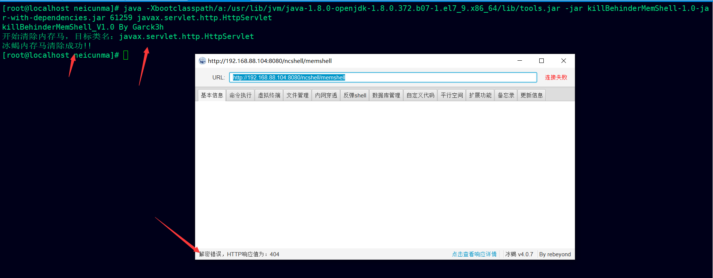

# killBehinderMemShell
## 冰蝎内存马清除工具
冰蝎内存马卸载工具

内存马的查杀功能有待实现。

目前只针对了tomcat进行测试

## 实现原理
Main类

* 通过命令行参数判断用户是否提供了进程ID和目标类名，如果未提供则输出提示信息并终止程序。
* 输出欢迎信息和目标类名。
* 使用`VirtualMachine.attach()`方法连接到指定的进程。
* 使用`VirtualMachine.loadAgent()`方法加载Agent并传递Agent参数。

Agent类

* 获取所有已加载的类。
* 遍历已加载的类，如果找到目标类，则使用`Javassist`库修改目标类。
* 最后，通过`Instrumentation.redefineClasses()`方法重新定义类，将修改后的字节码替换原始类的字节码。

## 如何使用？
可以自行下载项目进行编译

也可以直接下载jar：

```java
https://github.com/Garck3h/killBehinderMemShell/releases/download/release/killBehinderMemShell-1.0-jar-with-dependencies.jar
```
上传到目标服务器；使用jps查看tomcat的进程


命令参数如下

```java
/usr/lib/jvm/java-1.8.0-openjdk-1.8.0.372.b07-1.el7_9.x86_64/lib/tools.jar  为自己服务器jdk自带的的tools.jar的位置
61259 为tomcat的Bootstrap进程id
javax.servlet.http.HttpServlet 为需要重置的类名（冰蝎默认向该类名注入memshell）
```
使用示例：

```java
java -Xbootclasspath/a:/usr/lib/jvm/java-1.8.0-openjdk-1.8.0.372.b07-1.el7_9.x86_64/lib/tools.jar -jar killBehinderMemShell-1.0-jar-with-dependencies.jar 61259 javax.servlet.http.HttpServlet
```



## 声明：使用次工具造成损失或者触犯法律的均与工具提供者无关
